# Arkon

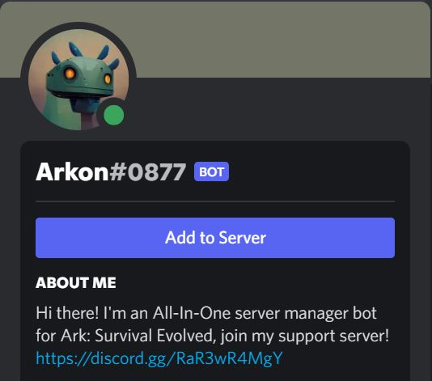

Arkon is an all-in-one server management Discord bot for Ark: Survival Evolved!

Some features include:

| Cog                              | Description                                                                                                                                                                                                                                                                                                                                       |
|----------------------------------|---------------------------------------------------------------------------------------------------------------------------------------------------------------------------------------------------------------------------------------------------------------------------------------------------------------------------------------------------|
| RCON Commands                    | 

Standard RCON commands available for any servers.

                                                                                                                                                                                                                                                           |
| Cross-chat                       | 

Server to Discord chat and vice versa.

                                                                                                                                                                                                                                                                      |
| In-Game commands                 | 

Use certain commands from in-game.
players in-game can start votes to change the time to day or night, wipe wild dinos, do "payday" commands that give them items that you can set specifically along with a cooldown, and even register their implant ID so they can use the commands easier.
               |
| Join/Leave logs                  | 

See who is coming and going.

                                                                                                                                                                                                                                                                                |
| Admin logs                       | 

Tool for sending RCON commands to your ECO game server.

                                                                                                                                                                                                                                                     |
| Tribe logs                       | 

Simple emoji tracker with leaderboards.

                                                                                                                                                                                                                                                                     |
| AutoFriend                       | 

Set any channel as a two-way translator for fluent conversation.
Have the bot Automatically manage your host gamertag friends list, it will prune accounts that unfollow them, or go inactive after a certain amount of time that you can set, and also unfollow if a user registers and leaves the discord.
 |
| Full Event logs                  | 

View detailed info about what the bot is doin.
keep track of new players detected on the server, and see exactly what the bot is doing with the host gamertags as it manages the friends lists
                                                                                                               |
| Blacklists                       | 

Blacklist character names or individual players altogether
if someone names themselves human ect the bot auto renames them
                                                                                                                                                                                   |
| Global leaderboards              | 

Get inspirational messages.
with global player leaderboard, cluster leaderboard, and individual playerstats showing key info about a player like what maps they play on, how much time they spend on them ect..
                                                                                              |
| Personal playtime stats          | 

Streamlined Discord Leveling System.

                                                                                                                                                                                                                                                                        |                                                                                                                                           
| In-Game Playtime ranks and roles | 

Players can gain discord roles and ranks as their playtime increases

                                                                                                                                                                                                                                        |                                                                                      
| Discord-side leveling system     | 

Streamlined Discord Leveling System.
 A simple yet full-featured leveling system with prestige features, customizable backgrounds, toggleable embed/image profiles, and extensive voice tracking options.
                                                                                                    |
| Live server-status embeds        | 

Server-status embeds for updated stats with a clean player count graph

                                                                                                                                                                                                                                      |
| SELF-CHECKOUT SHOP               | 

Fully automated shop system to send items to players via rcon commands
Easily configurable with the provided template, relax as Arkon handles all your transactions for you.
                                                                                                                                 |
| Anti-Rogue-Admin protection      | 

Auto ban any unauthorized players that discover the admin pass if they dont also have the full access role in the discord.

                                                                                                                                                                                  |
| Anti-Nuke protection             | 

Auto-kick or ban any rogue admins that try to nuke your server

                                                                                                                                                                                                                                              |
| ECONOMY                          | 

Arkon comes with a built-in ecosystem, with a fully configurable currency system, games, role paydays, and more.

                                                                                                                                                                                            |
| Support Ticket System            | 

Configurable support panel systems.
Handle player support questions or issues in your server easily with a fully featured support ticket panel system.
                                                                                                                                                       |
| Xbox tools                       | 

View your Xbox profile, friends, screenshots and game clips using simple commands and interactive menus.

                                                                                                                                                                                                    |

[**INVITE ARKON TO YOUR SERVER**](https://discord.com/api/oauth2/authorize?client_id=857070505294430218&permissions=2416307280&scope=applications.commands%20bot)

[**JOIN THE SUPPORT SERVER**](https://discord.gg/RaR3wR4MgY)

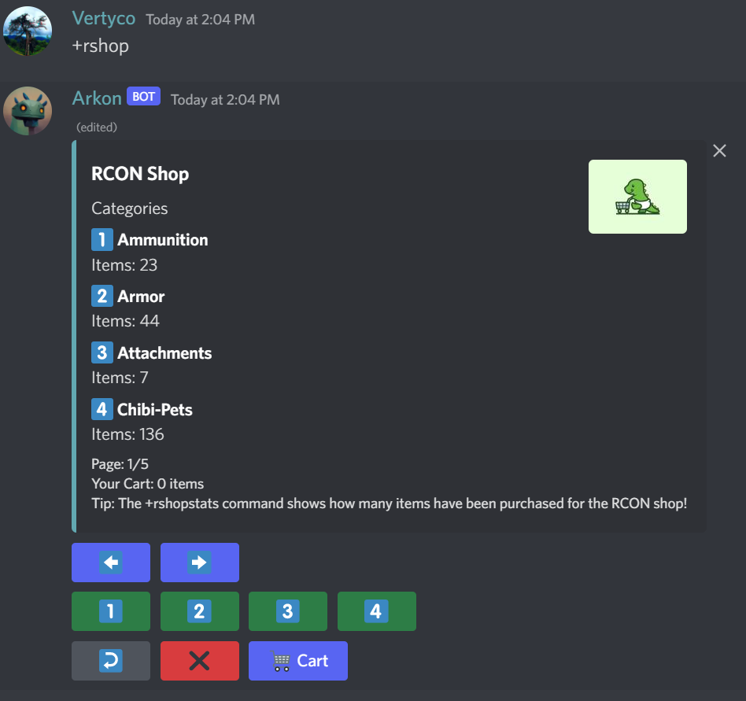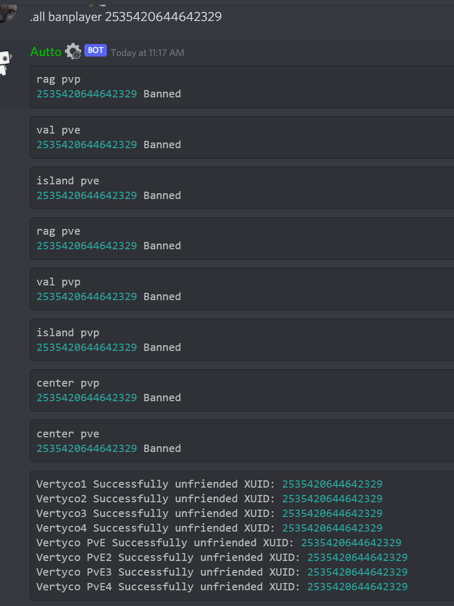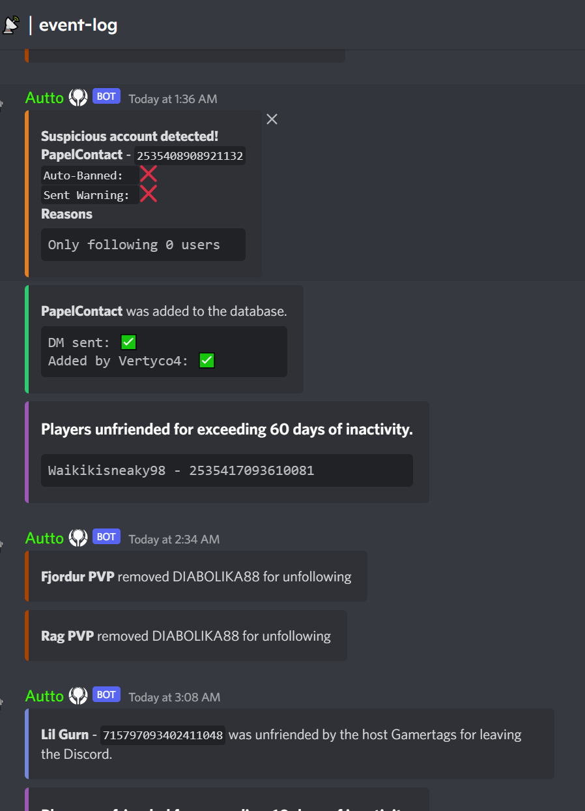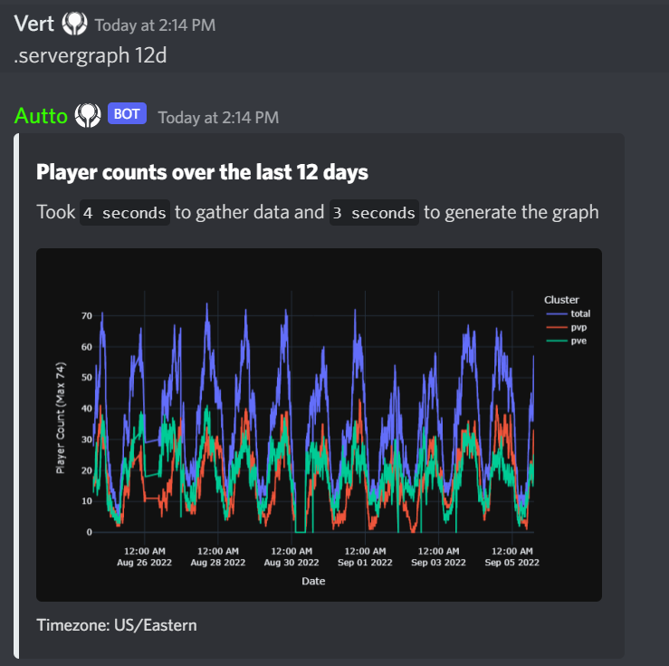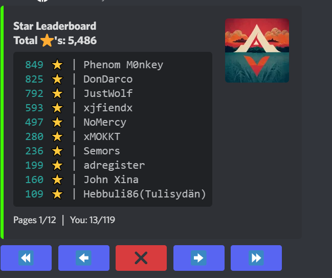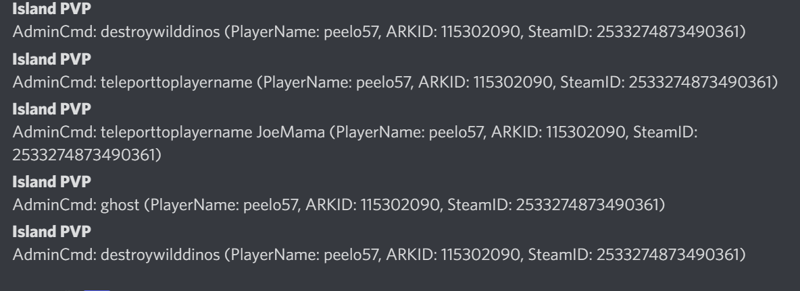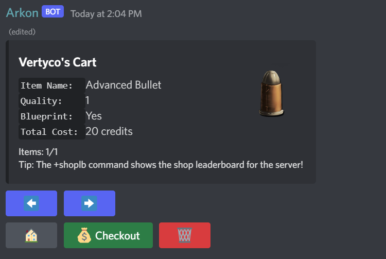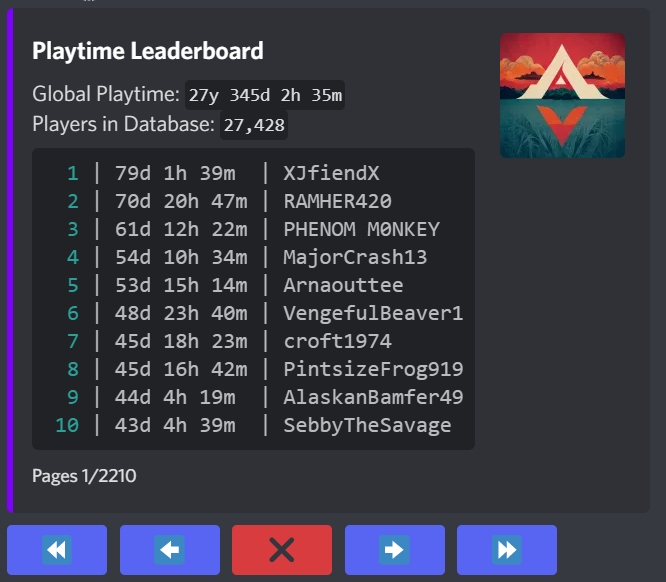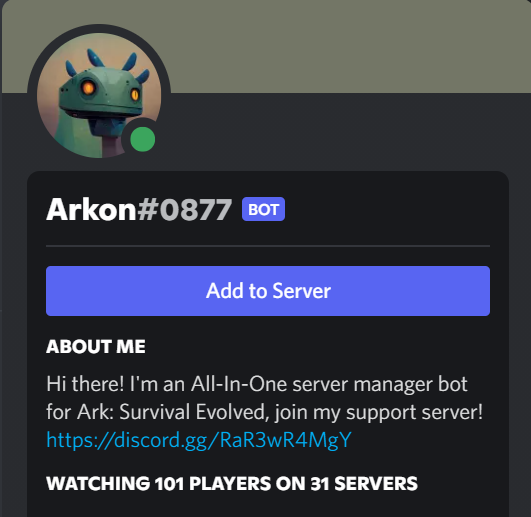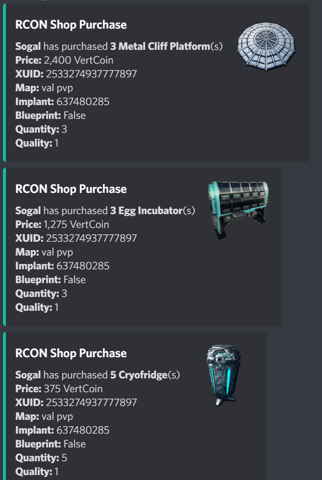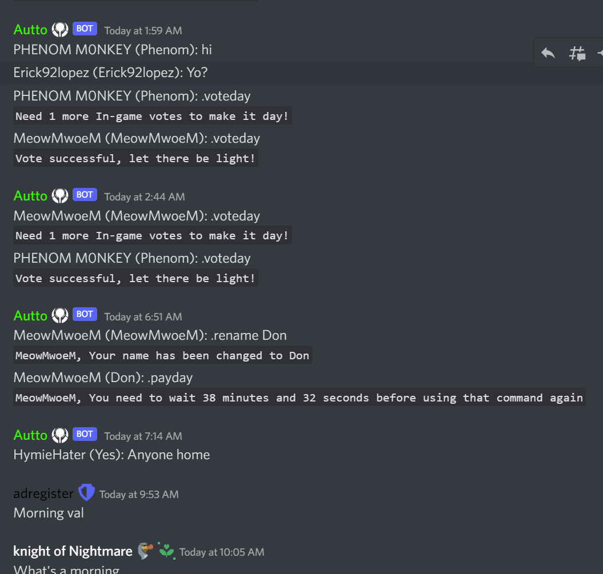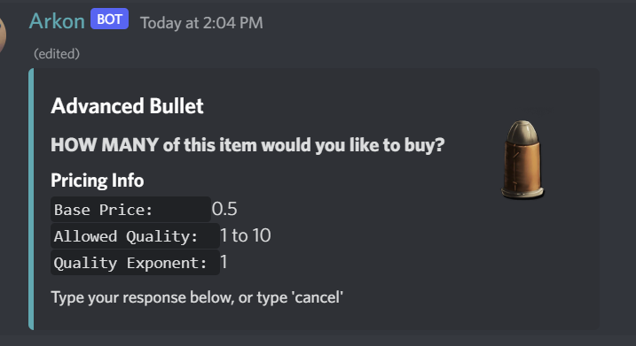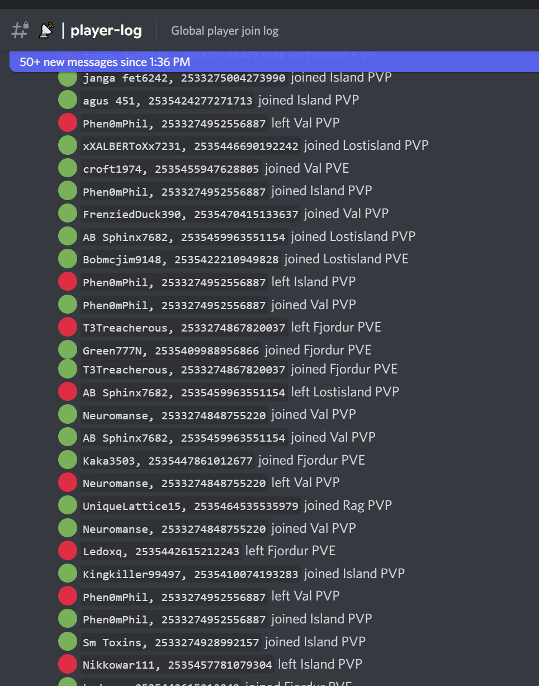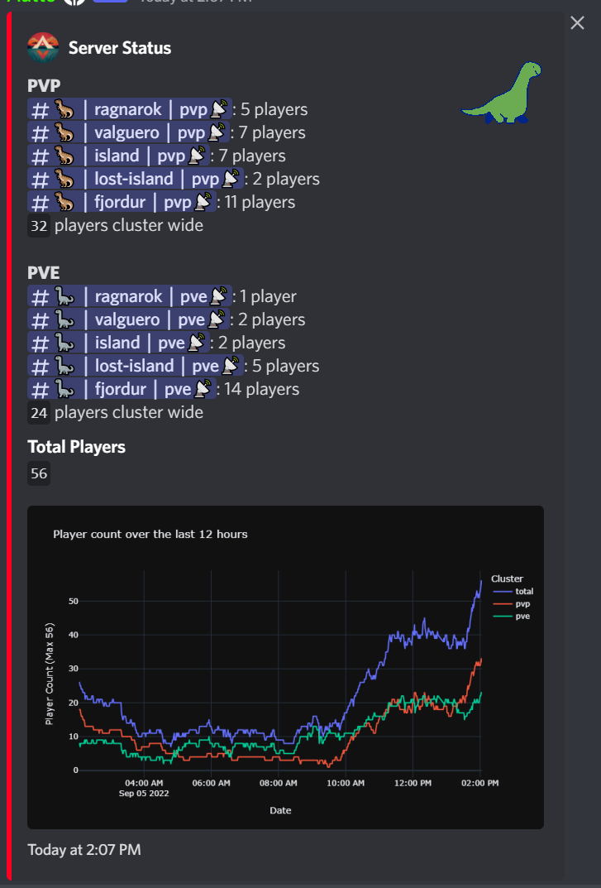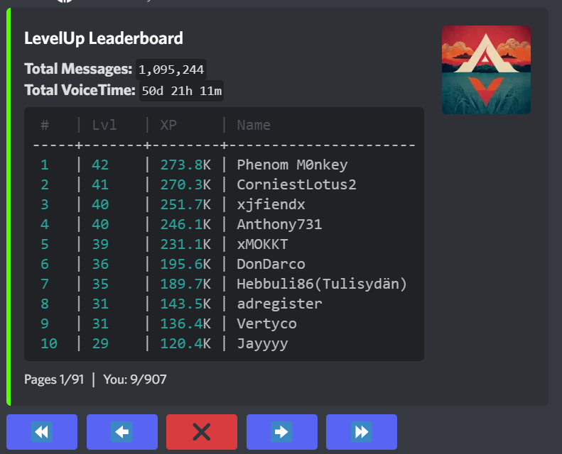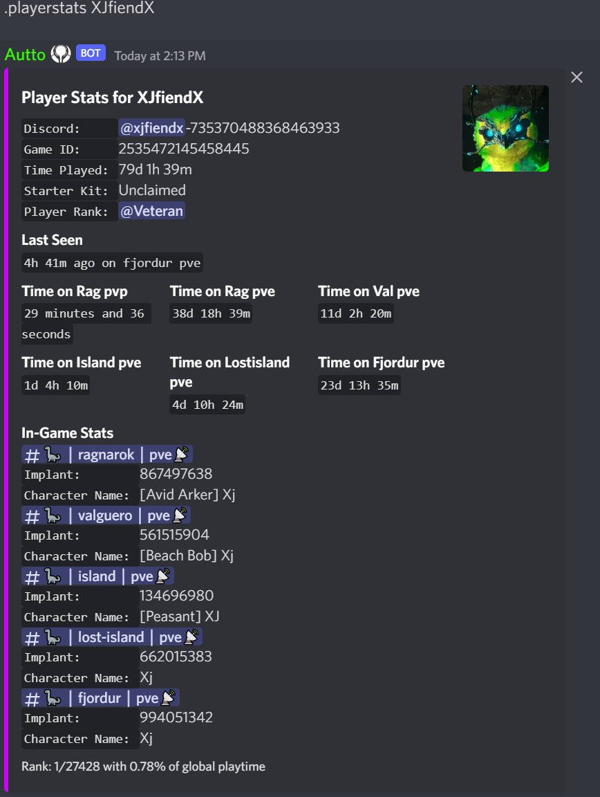